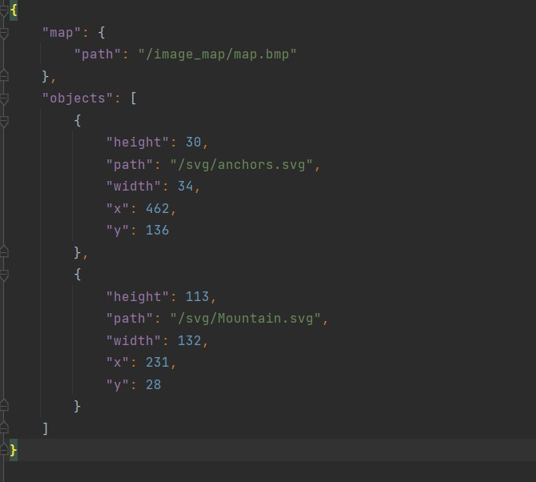

# DrawSVG

## Описание

Разработанная программа позволяет растеризовывать условные знаки в векторном формате SVG на электронных картах ГИС "Горизонт". Пргограмма имеет следующую функциональность:
1. загрузка растровой подложки;
2. загрузка карты конфигурационного файла с условными знаками;
3. добавление условного знака на электронную карту;
4. сохранение готовой карты с условными знаками в растровом формате (JPEG, PNG, BMP);
5. создание конфигурационного файла карты с условными знаками в формате JSON с последующим сохранением на компьютере;
6. изменение размера и перемещение условных знаков на растровой подложке.

## Инструкция по подключению библиотек

В проекте уже сгенированны два файла конфигурации [CMakeLists.txt](https://github.com/Sergey030520/DrawSVG/blob/4a86d1db5301a9ea4958864bc5388e7e0ff71ed8/CMakeLists.txt) (Производит поиск библиотек Qt5, устанавливает глобальные переменные и подключает папку src с файлами классов программы) и [CMakeLists.txt](https://github.com/Sergey030520/DrawSVG/blob/4a86d1db5301a9ea4958864bc5388e7e0ff71ed8/src/CMakeLists.txt) (Подключает библиотеку Qt5 и производит допонительну настройку проекта).

## Инструкция по сборке

Сборка проекта производится с помощью инструмента [CMake](https://cmake.org/). В терминале компьютера необходимо прописать следующие команды: 

```
cmake --build . --config Release --target main
```
## Интерфейс приложения
Проектирование и создание графического интерфейса приложения реализовано с помощью инструмента Qt Designer. Интерфейс главного окна представлен в файле [gui.ui](ui/gui.ui). Основное окно приложения состоит из графической сцены и 5 кнопок:
+ кнопки загрузки растрового изображения карты;
+ кнопки загрузки карты с объектами и их настройками;
+ кнопки добавления объектов;
+ кнопки сохранения карты с объектами и их настройками;
+ кнопки сохранения карты в растровом формате.

Компоновка графических элементов реализована с помощью классов "QHorizontalLayout" и "QVerticalLayout".


## Пример создания готовой растровой карты с условными знаками
В начале необходимо выбрать растровую подложку. В качетсве примера была взята карта Ялты:

Затем необходимо выбрать условный знак в формате SVG. В качестве примера был разработан условный знак "Якорь":

После того как был выбран условный знак, необходимо выбрать на карте место нажав мышью в выбранном месте и затем будет произведена растеризация данного УЗ на карте.


## Пример конфигурационного файла


